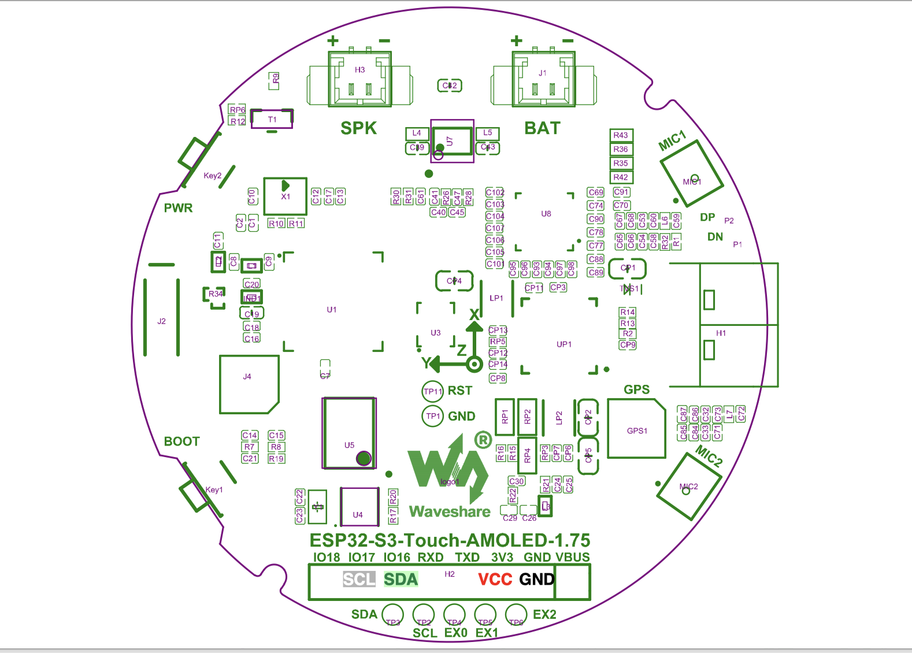
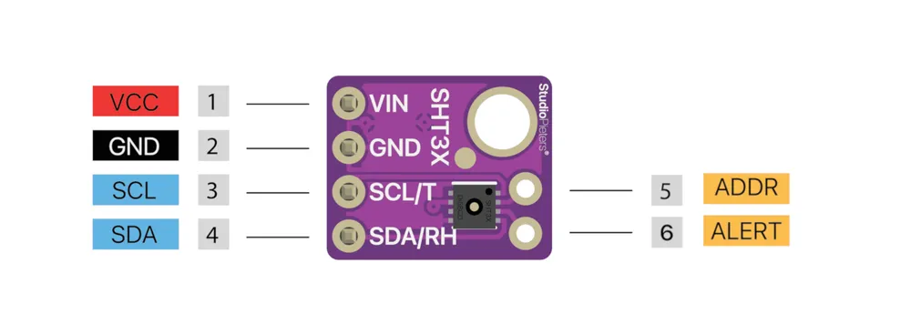

# 🌡️ Tem(H)u — Ambient Sensor Display

**Tem(H)u** stands for **Tem**perature + **H**umidity — a compact ambient sensor display showing temperature, humidity and a clock, based on ESPHome and the Waveshare ESP32-S3 AMOLED Touch Display.

<p align="center">
  <a href="https://www.gnu.org/licenses/gpl-3.0"></a>
  
  <a href="https://esphome.io"></a>
  
</p>

---

## 💡 Design Philosophy

Most sensor displays show you numbers. Tem(H)u tells you something.

The idea was simple: a glance should be enough. Not a glance at digits you then have to interpret — but a glance that already carries the answer. Is the air comfortable right now? Or does something feel off?

At the heart of the display are two counter-rotating arcs. They move in opposite directions, creating a calm, balanced composition. Their color shifts gradually and intentionally: a cool blue for comfortable ranges, drifting into warm amber or deep red as values move out of the ideal zone.

No alerts. No flashing. Just a quiet, honest signal — designed to be read at a glance, from across the room, without demanding your attention.

> *This is not a data display. It is an ambient one.*

---

## ✨ Features

- 📊 **Live readings** — temperature, humidity & clock on 3 swipeable pages
- 🎨 **Color-coded arc ring** — smooth color transitions based on current values
- 📈 **24h history graph** — 96 data points × 15 min, auto-scaling Y-axis
- 🌐 **Full web interface** — all settings configurable in the browser, no app needed
- 📡 **MQTT + Home Assistant** — auto-discovery, no manual entity setup
- 🔧 **Static IP support** — with automatic gateway derivation
- 🕐 **45 timezones** — including DST, fully configurable
- 📏 **Calibration offsets** — temperature & humidity correction built in

---

## 🖥️ Hardware Specs

| | **Tem(H)u Macro** |
|:---|:---:|
| **Display** | 1.75″ AMOLED |
| **Resolution** | 466 × 466 px |
| **Chip** | ESP32-S3 |
| **Sensor connection** | 8-pin header |
| **Power management** | AXP2101 |

---

## 🚀 Quick Start

```
1. Wire SHT31 sensor to display header
2. Flash factory firmware via web.esphome.io  (USB)
3. Connect to Wi-Fi via Captive Portal
4. Open  http://temhu-macro.local
```

---

## 📦 1. Required Hardware

### Display

| Model | Waveshare | Amazon |
|:---|:---|:---|
| **Tem(H)u Macro** — Waveshare ESP32-S3 Touch AMOLED 1.75″ | [waveshare.com ↗](https://www.waveshare.com/product/arduino/displays/amoled/esp32-s3-touch-amoled-1.75.htm) | [amazon.de ↗](https://amzn.eu/d/02WxzvqB) |

### Sensor

| Component | Link |
|:---|:---|
| **SHT31 Temperature & Humidity Sensor** | [amazon.de ↗](https://amzn.eu/d/0eq1gztV) |

### USB Cable

| Component | Link |
|:---|:---|
| **USB-C Extension (angled)** | [amazon.de ↗](https://amzn.eu/d/02FcL0DR) |

> [!IMPORTANT]
> The Amazon link leads to an **angled USB-C extension**. With this extension, power must be supplied via **USB-C to USB-A** cable only — USB-C to USB-C combined with the extension does not work.
> Alternatively, a directly angled USB-C cable may be used (untested).

### Accessories

| Required |
|:---|
| Dupont jumper cables **Male–Female** |

---

## 🔌 2. Connecting the Sensor

> [!IMPORTANT]
> Connect the sensor **before** the first flash. The display does not need to be powered while wiring.

### Tem(H)u Macro — 8-Pin Header (GPIO 16/17)



Connect via Dupont **Male–Female** cables (male to board, female to SHT31):

| SHT31 Pin | GPIO | Function |
|:---|:---|:---|
| VCC | 3.3V | Power |
| GND | GND | Ground |
| SDA | **GPIO 16** | I2C Data (Bus B) |
| SCL | **GPIO 17** | I2C Clock (Bus B) |



> [!NOTE]
> Use the dedicated 8-pin header on the back. Do not use Bus A (GPIO14/15) — reserved for touch and AXP2101.

### 📦 Sensor Mounting in Housing

Fix the SHT31 sensor inside the base housing using **double-sided tape** on the back of the sensor board.

> [!IMPORTANT]
> Place the sensor at the **far end of the base housing** so that air can circulate freely around it.
> Blocking airflow leads to inaccurate temperature and humidity readings.

**Sensor installation in base:**


**Display case mounted on sensor base:**


---

## ⚡ 3. Flashing the Firmware

> [!IMPORTANT]
> Flash must be done via USB using the factory firmware binary.

**Required:** Chrome or Edge browser at [web.esphome.io](https://web.esphome.io)

### Firmware File

> [!NOTE]
> **This is the initial release — v2.0.0.** The firmware file is provided in this repository under [`https://github.com/smogaone/TemHu/releases`].

| File | Purpose |
|:---|:---|
| `temhu-macro-firmware.factory(2.0.0).bin` | Full factory image — bootloader + partitions + firmware |

> [!NOTE]
> The version number (e.g. `2.0.0`) will increment with future releases. Always use the latest available version.

### Steps

1. Open [web.esphome.io](https://web.esphome.io) in Chrome or Edge
2. Connect display via **USB-C cable**
3. Click **"Connect"** → select serial port from the list
4. Click **"Install"** → select the **Factory** `.bin` file
5. Wait ~2–4 minutes · device restarts automatically

---

## 📶 4. Wi-Fi Setup (Captive Portal)

After the first boot without a saved network, the device opens a Wi-Fi access point:

| AP Name |
|:---|
| `Tem(H)u Macro` |

**Steps:**

1. Connect to **`Tem(H)u Macro`** — no password required
2. Captive Portal opens automatically — if not, go to `http://192.168.4.1`
3. Select Wi-Fi → enter password → click **"Connect"**
4. Device joins home network and restarts · AP disappears

> [!TIP]
> If the AP doesn't close automatically: disconnect power briefly and restart.

---

## 🌍 5. Web Interface

| URL |
|:---|
| http://temhu-macro.local |

> [!TIP]
> If `.local` doesn't resolve (Windows without mDNS): use the IP address from your router's DHCP list.

All settings are available via the web interface.

---

## 🖥️ 6. User Interface

### Pages

| Page | Content |
|:---|:---|
| **Humidity** | Current value in % + 24h history graph |
| **Temperature** | Current value in °C + 24h history graph |
| **Clock** | Time · Date · Weekday · Daily min/max |

**Navigation:** Swipe left/right · Auto-cycles every ~15 seconds

**24h History Graph:** 96 points × 15 min = 24 h · Y-axis auto-scales · builds up gradually after startup

<details>
<summary>🎨 Animation Ring Color Coding</summary>

The rotating arc ring transitions color smoothly based on the current reading.

**Humidity:**

| Range | Color | Meaning |
|:---|:---|:---|
| < 30% | 🔵 Light blue `#8BC5E8` | Too dry |
| 30 – 40% | Light blue → Mint green | Transition |
| 40 – 60% | 🟢 Mint `#7EDCB5` → Sage `#A8D8A8` | Optimal |
| 60 – 70% | Sage → 🟡 Amber `#F5C77E` | Transition |
| > 70% | 🔴 Coral `#E88B8B` | Too humid |

**Temperature:**

| Range | Color | Meaning |
|:---|:---|:---|
| < 16°C | 🔵 Light blue `#8BC5E8` | Too cold |
| 16 – 18°C | Light blue → Mint green | Transition |
| 18 – 22°C | 🟢 Mint `#7EDCB5` → Sage `#A8D8A8` | Optimal |
| 22 – 26°C | Sage → 🟡 Amber `#F5C77E` | Transition |
| > 26°C | 🟣 Lavender `#B39DDB` | Too warm |

**Clock:** Always 🟢 Mint `#7EDCB5`

</details>

---

## ⚙️ 7. Settings

All settings at `http://temhu-macro.local`

### 8.1 Display

| Setting | Range | Default | Description |
|:---|:---:|:---:|:---|
| **Daytime Brightness** | 10 – 255 | 248 | Brightness during the day |
| **Auto-Dim Display** | On/Off | Off | Auto-dim at night |
| **Auto-Dim Brightness** | 1 – 100 | 20 | Brightness when dimmed |
| **Auto-Dim Start (Hour)** | 0 – 23 | 22 | Hour dimming begins |
| **Auto-Dim End (Hour)** | 0 – 23 | 7 | Hour brightening resumes |
| **Show Time and Date** | On/Off | On | Show/hide clock page |
| **Time Format (12h AM-PM)** | On/Off | Off | 24h or 12h format |

### 8.2 Network — Static IP *(optional)*

Default is **DHCP** — no configuration needed.

| Setting | Format | Description |
|:---|:---|:---|
| **Network: Static IP** | `192.168.x.x` | Fixed IP (empty = DHCP) |
| **Network: Gateway** | `192.168.x.1` | Gateway (empty = auto-derived from IP) |
| **Network: Subnet Mask** | `255.255.255.0` | Subnet (empty = `255.255.255.0`) |

> [!NOTE]
> **Auto gateway:** If left empty, gateway = static IP with last octet replaced by `.1`. Example: `10.20.5.100` → `10.20.5.1`

> [!IMPORTANT]
> Restart required after changing static IP settings.

### 8.3 Timezone

| Setting | Description |
|:---|:---|
| **Timezone** | 45 predefined timezones (dropdown) |
| **Timezone Custom (POSIX)** | Override, e.g. `CET-1CEST,M3.5.0,M10.5.0/3` |

Default: `Europe/Berlin (+1)` — DST handled automatically.

### 8.4 Calibration

| Setting | Range | Step | Default |
|:---|:---:|:---:|:---:|
| **Temperature Offset** | -10.0 – +10.0 °C | 0.1 °C | 0.0 °C |
| **Humidity Offset** | -20.0 – +20.0 % | 0.5 % | 0.0 % |

> [!TIP]
> Let the device warm up for 30 minutes before calibrating — the SHT31 needs a settling period.

### 8.5 MQTT & Home Assistant

| Setting | Description |
|:---|:---|
| **01. MQTT Username** | Broker username |
| **02. MQTT Password** | Broker password |
| **03. MQTT Discovery Topic** | Auto-discovery prefix (default: `homeassistant`) |
| **04. MQTT Broker IP** | Broker IP address |
| **05. MQTT Port** | Port (default: `1883`) |
| **06. MQTT Auto-Discovery** | Enable — restart required |

<details>
<summary>📡 MQTT Topics (published every 30 seconds)</summary>

```
temhu-macro/sensor/humidity/state       → Humidity in %
temhu-macro/sensor/temperature/state    → Temperature in °C
temhu-macro/sensor/esp_temp/state       → ESP32 chip temperature
temhu-macro/sensor/wifi_signal/state    → Wi-Fi signal in dBm
temhu-macro/sensor/uptime/state         → Formatted uptime
```

</details>

**Home Assistant setup:**

1. Enter broker IP, port, username and password in the web interface
2. Enable **"06. MQTT Auto-Discovery"** · restart device
3. All sensors appear under **Settings → Devices & Services → MQTT**

> [!NOTE]
> MQTT is entirely optional. Tem(H)u works as a standalone display without any MQTT configuration.

---

## 🔧 8. Maintenance & Troubleshooting

### Controls

| Action | How |
|:---|:---|
| **Restart** | `http://temhu-macro.local` → "Restart" |
| **Factory Reset** | `http://temhu-macro.local` → "Reset Factory Settings" |

> [!CAUTION]
> Factory Reset erases all saved settings (Wi-Fi, IP, MQTT, offsets, brightness). Firmware remains intact. Device reopens Captive Portal after reset.

### Diagnostic Sensors

Available in the web interface and Home Assistant (MQTT active):

`WiFi Signal` · `ESP Temperature` · `Uptime` · `IP Address` · `MAC Address` · `ESPHome Version`

<details>
<summary>🩺 Common Issues</summary>

| Problem | Solution |
|:---|:---|
| No Wi-Fi AP after flash | Restart — AP appears when no network is saved |
| Captive Portal doesn't open | Go to `http://192.168.4.1` manually |
| `.local` not reachable | Use IP from router DHCP list directly |
| Sensor shows `---` | Check I2C wiring — SHT31 address = `0x44` |
| Wrong temperature | Adjust offset under "Calibration" in web interface |
| Static IP not working | Restart after setting IP; leave gateway empty = auto |

| Display stays black | Disconnect power, wait 10 s, reconnect |
| Graph shows only one point | Normal — builds every 15 min, full after 24 h |

</details>

---

## ⚠️ Disclaimer

This project is provided **as-is**, without any warranty of any kind —
express or implied — including but not limited to warranties of
merchantability, fitness for a particular purpose, or non-infringement.

**Use at your own risk.**

The author(s) of this project accept **no liability** for any of the
following, whether direct, indirect, incidental, or consequential:

- Damage to hardware, displays, sensors, or any connected components
- Fire, electrical damage, or damage to property
- Data loss or corruption
- Personal injury
- Voided manufacturer warranties of any device used with this project
- Any other damage arising from the use, misuse, or inability to use
  this software or hardware configuration

This project involves **do-it-yourself electronics** and flashing
third-party firmware onto consumer hardware. Working with electronics
carries inherent risks. Always ensure proper handling, use appropriate
power supplies, and verify all wiring before powering any device.

The GPL v3 license under which this project is distributed also
explicitly disclaims all warranty — see [LICENSE](LICENSE) for details.

---

## 📄 License

This project is licensed under the **GNU General Public License v3.0** — see [LICENSE](LICENSE) for details.

---

*Built with [ESPHome](https://esphome.io) · Display by [Waveshare](https://www.waveshare.com)*
